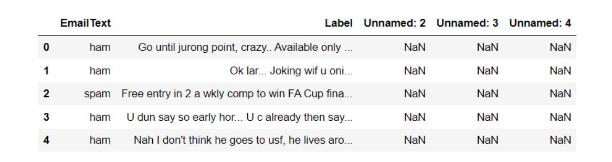
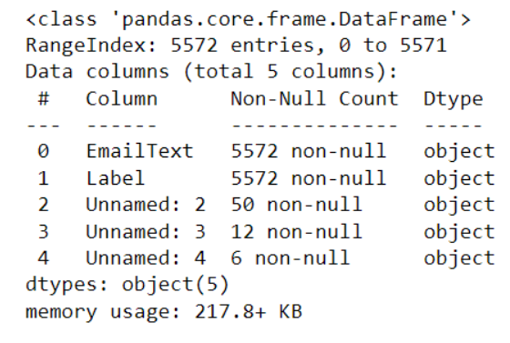
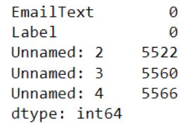
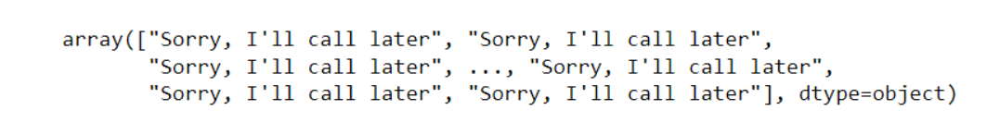
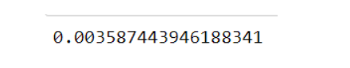

# Implementation-of-SVM-For-Spam-Mail-Detection...

## AIM:
To write a program to implement the SVM For Spam Mail Detection.

## EQUIPMENTS REQUIRED:
1. Hardware – PCs.
2. Anaconda – Python 3.7 Installation / Moodle-Code Runner.

## ALGORITHM:
### Step 1:
Import the necessary python packages using import statements. 

### Step 2:
Read the given csv file using read_csv() method and print the number of contents to be displayed using df.head(). 

### Step 3:
Split the dataset using train_test_split.

### Step 4:
Calculate Y_Pred and accuracy.

### Step 5:
Print all the outputs.

### Step 6:
End the Program.

## PROGRAM:
```
/*
Program to implement the SVM For Spam Mail Detection....
Developed by: PRANAVE B
RegisterNumber: 212221240040
*/

import pandas as pd
data=pd.read_csv("spam.csv",encoding='latin-1')

data.head()

data.info()

data.isnull().sum()

x=data["EmailText"].values
y=data["Label"].values

from sklearn.model_selection import train_test_split
x_train,x_test,y_train,y_test=train_test_split(x,y,test_size=0.2,random_state=0)

from sklearn.feature_extractiaon.text import CountVectorizer
cv=CountVectorizer()

x_train=cv.fit_transform(x_train)
x_test=cv.transform(x_test)

from sklearn.svm import SVC
svc=SVC()
svc.fit(x_train,y_train)

y_pred=svc.predict(x_test)
y_pred

from sklearn import metrics
accuracy=metrics.accuracy_score(y_test,y_pred)
accuracy

```

## OUTPUT:

### DATA.HEAD():


### DATA.INFO():


### DATA.ISNULL().SUM():


### Y_PRED:


### ACCURACY:


## RESULT:
Thus the program to implement the SVM For Spam Mail Detection is written and verified using python programming.
